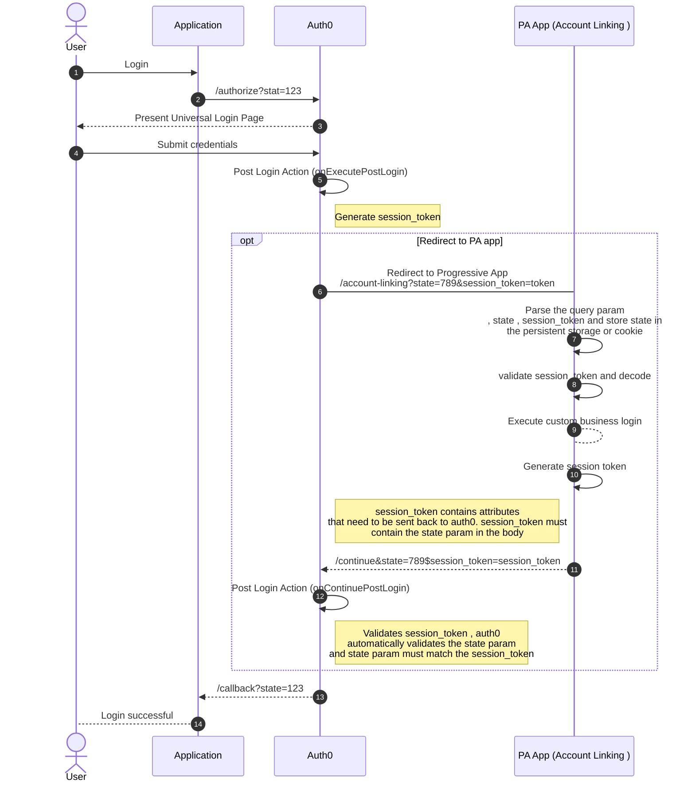

```mermaid

    sequenceDiagram 
    actor u as User 
    participant a as Application
    participant a0 as Auth0
    participant pApp as PA App (Account Linking )
    autonumber

    u ->> a : Login 
    a ->> a0: /authorize?stat=123
    a0 -->> u: Present Universal Login Page 
    u ->> a0: Submit credentials 
    a0->> a0: Post Login Action (onExecutePostLogin)
    note right of a0: Generate session_token
    opt Redirect to PA app
    a0 -> pApp: Redirect to Progressive App  <br/>/account-linking?state=789&session_token=token
    pApp ->> pApp: Parse the query param  <br/>, state , session_token and store state in <br/> the persistent storage or cookie 
    pApp ->> pApp: validate session_token and decode 
    pApp --> pApp : Execute custom business login
    pApp ->> pApp: Generate session token 
    note left of pApp: session_token contains attributes <br/>  that need to be sent back to auth0. session_token must <br/>contain the state param in the body
    pApp -->> a0 : /continue&state=789$session_token=session_token 
    a0->> a0: Post Login Action (onContinuePostLogin)
    note right of a0: Validates session_token , auth0 <br/>automatically validates the state param <br/>and state param must match the session_token
    end
    a0 -->> a : /callback?state=123
    a --> u: Login successful

```